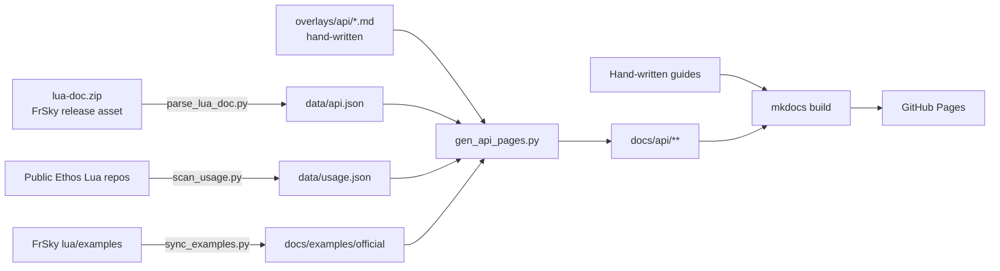

# Contributing

This site lives at [github.com/FrSkyRC/ethos-lua-doc](https://github.com/FrSkyRC/ethos-lua-doc). Corrections, examples and new guides are welcome.

## How the site is built



- **Generated** (don't edit): `docs/api/`, `docs/examples/official/`, `data/api.json`, `data/usage.json`.
- **Hand-written**: everything else under `docs/`, the cookbook scripts in `examples/cookbook/`, and the API example overlays in `overlays/api/`.

## Ways to help

| You want to | Do this |
| --- | --- |
| Fix a typo in a guide | Use the ✏️ edit button on the page |
| Add an example to an API page | Use the ✏️ edit button on that API page. It opens (or creates) the right overlay file. See [Writing examples](writing-examples.md) |
| Report wrong API information | If FrSky's lua-doc is wrong, report it on [ETHOS-Feedback-Community](https://github.com/FrSkyRC/ETHOS-Feedback-Community/issues). Meanwhile, add a note in an overlay |
| Add your project to Real-world usage | See [Real-world usage](real-world-usage.md) |
| Refresh the API docs | See [Updating the API docs](updating.md) |

## Local preview

```bash
git clone https://github.com/FrSkyRC/ethos-lua-doc
cd ethos-lua-doc
python -m venv .venv
.venv/bin/pip install -r requirements.txt        # Windows: .venv\Scripts\pip
.venv/bin/mkdocs serve                           # http://127.0.0.1:8000
```

Maintainers and AI agents: [`AGENTS.md`](https://github.com/FrSkyRC/ethos-lua-doc/blob/main/AGENTS.md) in the repo root has the full workflow and rules.
