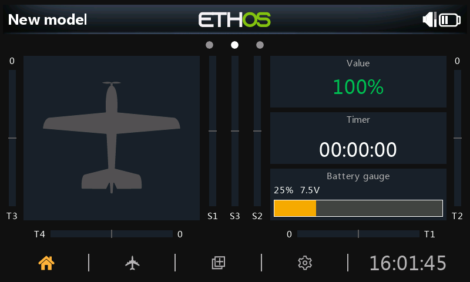

# Cookbook

Complete scripts you can copy onto a radio. Each recipe is a real file in [`examples/cookbook/`](https://github.com/FrSkyRC/ethos-lua-doc/tree/main/examples/cookbook) of this site's repository, embedded here unchanged. They all follow the [best practice](../best-practice/index.md) rules, with comments where a rule applies.

{ loading=lazy }
<small>The value, timer and battery gauge recipes on an X20S in the Ethos 26.1 simulator.</small>

| Recipe | Type | Shows how to |
| --- | --- | --- |
| [Telemetry value widget](value-widget.md) | Widget | Font fitting, change detection, min/max, menu entries, versioned settings |
| [Battery gauge widget](battery-gauge.md) | Widget | Lookup curves, color thresholds, theme-aware drawing |
| [Background alert task](alert-task.md) | Task | Throttling, hysteresis, voice and haptic alerts, task settings |
| [System tool with a form](system-tool.md) | System tool | Forms, dialogs, file-based settings, absolute paths, cleanup on close |
| [Lua source](lua-source.md) | Source | Computed sources usable in mixes and logic switches |
| [Timer control](timer-control.md) | Widget | Model timers, touch events, context menus |
| [Memory monitor](memory-monitor.md) | Task | Measuring heap, bitmap RAM and stack while developing |

**Install any recipe:** copy its folder (for example `valuewgt/`) into the radio's `scripts/` folder, or the simulator's, and restart. Widgets then appear in the widget list of **Configure screens**, tools on the System menu, and tasks and sources under the model's **Lua** page.

!!! success "Tested in the simulator"
    Every recipe here was loaded in the Ethos 26.1 simulator (X20S) through [`ethos-tools`](../tools/ai-agents.md): no load errors, and the widgets, configuration forms and the tool were driven through the UI. Some of the pitfalls on this site, such as the [relative path bug](../best-practice/pitfalls.md#relative-paths-in-callbacks) and [mask polarity](../guides/drawing.md#bitmaps-and-masks), were found this way.

## More examples

- **[Official FrSky examples](../examples/official/index.md)**: twenty scripts from FrSky covering every script type.
- **Real-world usage on every API page**: excerpts from open-source projects showing how each function is used in production code.
