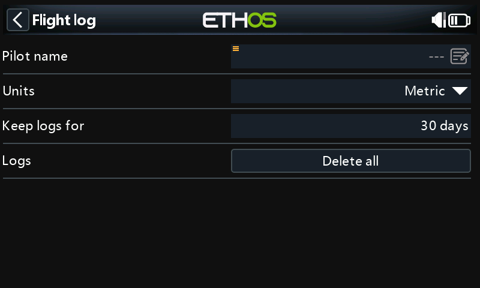

# System tool with a form

A tool on the System menu with a settings form (text, choice and number fields), a confirmation dialog, settings stored in a file, and everything released when the page closes.

{ loading=lazy width=480 }

## What it demonstrates

- **`registerSystemTool` with an icon.** The icon is required; without one Ethos logs `registerSystemTool(): missing icon`. It's a mask, so draw it **black on white** ([why](../guides/drawing.md#bitmaps-and-masks)).
- **Absolute paths for files used in callbacks.** Saving `"settings.lua"` with a relative path from `close()` wrote the file into a *different script's folder* in testing. See [Pitfalls](../best-practice/pitfalls.md#relative-paths-in-callbacks).
- **Non-recursive `os.mkdir`.** `LOGS:` is created before `LOGS:/flightlog`.
- **Write once, on close.** A `dirty` flag avoids touching flash for every keystroke.
- **Cleanup.** `close()` drops the page's state table so it can be collected.

## The script

```lua title="scripts/flightlog/main.lua" linenums="1"
--8<-- "examples/cookbook/flightlog/main.lua"
```

Copy `icon.png` from [the recipe folder](https://github.com/FrSkyRC/ethos-lua-doc/tree/main/examples/cookbook/flightlog) alongside `main.lua`.

## API used

[`system.registerSystemTool`](../api/system/registerSystemTool.md) · [`lcd.loadMask`](../api/lcd/loadMask.md) · [`form.clear`](../api/form/clear.md) · [`form.addTextField`](../api/form/addTextField.md) · [`form.addChoiceField`](../api/form/addChoiceField.md) · [`form.addNumberField`](../api/form/addNumberField.md) · [`form.addButton`](../api/form/addButton.md) · [`form.openDialog`](../api/form/openDialog.md)
