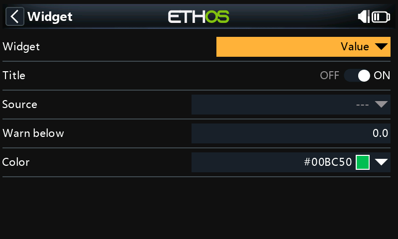

# Telemetry value widget

A widget that shows any source in the largest font that fits, turns a warning color below a threshold, tracks min/max, and adds **Reset min/max** to its long-press menu.

{ loading=lazy width=480 }

## What it demonstrates

- **Change detection at display precision.** The value is quantized to the source's decimals before comparing, so sensor noise doesn't cause redraws.
- **Cached font fitting.** Measuring text in several fonts is done only when the widget size or the text length changes.
- **File-level constants** for colors and the font list.
- **Versioned settings** (`storage.write("v", ...)`) so later releases can migrate.
- **A context menu** through the `menu` callback.

## The script

```lua title="scripts/valuewgt/main.lua" linenums="1"
--8<-- "examples/cookbook/valuewgt/main.lua"
```

## Variations

- **Show stale telemetry**: grey the text when `widget.source:age()` exceeds a few seconds (see [Sources & telemetry](../guides/telemetry.md#telemetry-freshness)).
- **Warn above instead of below**: add a choice field for the direction.
- **Use the theme's warning color**: replace `COLOR_WARN` with `lcd.themeColor(THEME_WARNING_COLOR)`.

## API used

[`system.registerWidget`](../api/system/registerWidget.md) · [`lcd.getWindowSize`](../api/lcd/getWindowSize.md) · [`lcd.getTextSize`](../api/lcd/getTextSize.md) · [`lcd.themeColor`](../api/lcd/themeColor.md) · [`Source:value`](../api/objects/Source/value.md) · [`Source:stringValue`](../api/objects/Source/stringValue.md) · [`Source:decimals`](../api/objects/Source/decimals.md) · [`form.addSourceField`](../api/form/addSourceField.md) · [`form.addNumberField`](../api/form/addNumberField.md) · [`storage.read`](../api/storage/read.md)
