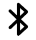

<!-- GENERATED by scripts/sync_examples.py. Do not edit. -->
# bluetooth

<div class="api-badges"><span class="api-badge api-badge--since">System tool</span> <a class="api-badge" href="https://github.com/FrSkyRC/ETHOS-Feedback-Community/tree/HEAD/lua/examples/bluetooth">view on GitHub</a></div>

Scan and connect Bluetooth devices (`bluetooth` namespace).

Install: copy the folder to `SCRIPTS:/bluetooth/` on the radio (or the simulator's `scripts/` folder) and restart.

```lua title="main.lua" linenums="1"
-- Lua Bluetooth Test

local icon = lcd.loadMask("bluetooth.png")

local function create()
    -- Reset the orientation
    -- bluetooth.write(0xAFF2, 0x52)
    
    -- Reset the orientation too
    -- bluetooth.write(0xAFF2, 'R')

    -- Changes the device name
    bluetooth.write(0xFFD4, 'My HT')
    system.exit()
    return nil
end

local function init()
    system.registerSystemTool({name="Bluetooth Test", icon=icon, create=create})
end

return {init=init}
```

## Assets

{ loading=lazy style="max-height:120px" }
