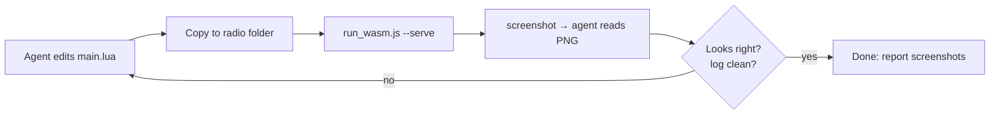

# AI agents & ethos-tools

[`FrSkyRC/ethos-tools`](https://github.com/FrSkyRC/ethos-tools) runs the Ethos WebAssembly simulator from the command line and exposes it as a small local HTTP API: boot a radio, take screenshots, tap, swipe, press keys, move sticks and switches, and read the console. With it, an AI coding agent can **test its own Lua changes on a simulated radio**. It writes the script, deploys it, looks at the screen and fixes what's wrong.

It ships as a [Claude Code](https://claude.com/claude-code) plugin, and works with any agent that can run shell commands.



## What you need

| Requirement | Notes |
| --- | --- |
| **Node.js 18+** | Runs `run_wasm.js` |
| **A simulator build** | A `<BOARD>_<PROTOCOL>.js` + `.wasm` pair such as `X20S_FCC.js`. The Ethos VS Code extension downloads these; run **Ethos: Start** in VS Code once and they're cached (paths below) |
| **A radio folder** | Any folder used as the radio's storage (`radio.bin`, `models/`, `scripts/`, ...). An empty folder boots a factory-fresh radio |

Where the VS Code extension caches builds:

| OS | Path |
| --- | --- |
| Windows | `%APPDATA%\Code\User\globalStorage\bsongis.ethos\cache\` |
| macOS | `~/Library/Application Support/Code/User/globalStorage/bsongis.ethos/cache/` |
| Linux | `~/.config/Code/User/globalStorage/bsongis.ethos/cache/` |

## Setup: Claude Code

Install the plugin from any Claude Code session:

```text
/plugin marketplace add FrSkyRC/ethos-tools
/plugin install ethos-simulator@ethos-tools
```

To make it automatic for everyone who opens **your** Lua project, commit this `.claude/settings.json` to the project. Claude Code then offers the plugin when the folder is trusted:

```json title=".claude/settings.json"
{
  "extraKnownMarketplaces": {
    "ethos-tools": {
      "source": { "source": "github", "repo": "FrSkyRC/ethos-tools" }
    }
  },
  "enabledPlugins": {
    "ethos-simulator@ethos-tools": true
  }
}
```

The plugin adds an **`ethos-navigate`** skill. Claude loads it when you ask things like:

- *"Deploy the widget to the simulator and show me what it looks like on an X18."*
- *"Open the Flight log tool, change Keep logs to 60 days, close it, and check the settings file was written."*
- *"Something throws an error when I configure the gauge. Reproduce it and fix it."*

If the skill doesn't appear (installed mid-session, or the install was declined), restart the session, or point Claude at `simulation/skills/ethos-navigate/SKILL.md` in a clone of `ethos-tools`.

## Setup: any other agent

Clone the repo and give the agent the runner's commands, either in your `AGENTS.md` (template below) or in the prompt:

```bash
git clone https://github.com/FrSkyRC/ethos-tools
node ethos-tools/simulation/run_wasm.js --help
```

## Driving the simulator

Start a server in the background, mounting a radio folder:

```bash
node run_wasm.js "<cache>/X20S_FCC.js" --serve --root-directory ./sim/radio --shots-dir ./sim/shots &
until node run_wasm.js status; do sleep 1; done      # boot takes a few seconds
```

Then send one-shot commands. Each prints JSON, and input commands wait for the screen to settle:

| Command | Effect |
| --- | --- |
| `status` | Screen size, switch positions, trims |
| `screenshot [file.png]` | Save the screen as PNG (the agent then reads the image) |
| `tap X Y` · `longpress X Y` · `swipe X1 Y1 X2 Y2 [ms]` | Touch, in screen pixels |
| `wheel N` | Rotary encoder detents |
| `press KEY [holdMs]` | `SYS` `MDL` `DISP` `RTN` `PAGE` `ENTER` |
| `switch I V` · `fswitch I V` · `analog I V` · `trim I V` | Physical controls |
| `macro PATH [timeoutMs]` | Run a Lua macro to completion |
| `log [n]` | Last *n* console lines: **Lua errors and `print` output appear here** |
| `wait MS` · `quit` | Pause; stop the simulator (always quit when done) |

Use `--port N` on the server and on each command to run several radios at once.

## The deploy-and-check loop

This is the loop used to test this site's [cookbook](../cookbook/index.md) recipes:

```bash
RADIO=./sim/radio
rm -f $RADIO/scripts/mywidget/*.luac              # Ethos compiles main.lua on load; drop stale bytecode
cp -r src/mywidget $RADIO/scripts/
node run_wasm.js quit; node run_wasm.js "$SIM" --serve --root-directory $RADIO &   # scripts load at boot
until node run_wasm.js status; do sleep 1; done
node run_wasm.js log 400 | grep -E "Lua|error"     # load errors show up right after Lua::load(...)
node run_wasm.js screenshot shots/home.png
```

What a healthy boot looks like in `log`:

```text
Lua::load('SCRIPTS:/mywidget/main.lua')
Lua::compile('main.luac', strip=0)
```

Problems show up the same way. For example, `Lua::registerSystemTool(): missing icon` appeared when a tool registered without an icon.

### First boot of a fresh radio folder

An empty radio folder walks through several dialogs before the home screen. Tell your agent to expect them:

1. **Select language** → OK
2. **Storage error, default system settings restored** → OK
3. **Model data load: Starting model wizard** → OK, then the **Create model** wizard (menu keys are ignored until it's finished)
4. On later boots: **Checklist warning** (throttle not idle) → OK

After that the folder keeps its model, so later boots go straight to the checklist and then home. To test without touching your real setup, copy the radio folder to a scratch location and mount the copy, because **the simulator writes to the folder it mounts**.

### Navigation notes (X20 family, 800×480)

- Back arrow at about (30, 33). Home-screen bottom bar: Home (78, 448), Model (225), Screens (372), System (518).
- `SYS`/`MDL`/`DISP` only work from the top level; press `RTN` (or tap the back arrow) until you're there.
- Lua system tools appear on the **System** menu's later pages (`PAGE` to move between pages).
- Widgets: `DISP` → tap a widget slot → **Widget** dropdown → your widget's `name` (scroll the list).
- Screenshot after every action; never chain blind taps. If one misses, the rest land on the wrong screen.

## An `AGENTS.md` for your Ethos Lua project

Drop this into your repository and adjust the paths. It works for Claude Code (which also reads `CLAUDE.md`; make that file contain `@AGENTS.md`), Codex, Cursor and others.

````markdown title="AGENTS.md"
# Agent guide: <your script>

Ethos Lua script for FrSky radios. Source in `src/<folder>/`, deployed to `scripts/<folder>/` on the radio.

## Reference
- API: https://frskyrc.github.io/ethos-lua-doc/api/ (machine-readable: /api/api-index.json)
- Best practice (RAM/CPU rules we follow): https://frskyrc.github.io/ethos-lua-doc/best-practice/

## Rules
- Hot paths (`wakeup`, `paint`, event handlers): no per-call table/closure/string allocation; `lcd.invalidate()` only on change.
- Absolute `SCRIPTS:/<folder>/...` paths for any file access after `init()`. Relative paths break in callbacks.
- Nil-check `getSource`, `createSensor`, `loadBitmap`, dialog handles. Guard newer APIs (`if fn then`).
- Release bitmaps/caches/handles in `close()`.

## Testing in the simulator
- Tooling: FrSkyRC/ethos-tools (`simulation/run_wasm.js`; Claude Code plugin `ethos-simulator@ethos-tools`).
- Build: `<BOARD>_<PROTOCOL>.js` from the Ethos VS Code extension cache (e.g. X20S_FCC; also test X18_EU for 480x320).
- Radio folder: `sim/radio/` (git-ignored). Deploy = copy `src/<folder>` to `sim/radio/scripts/`, delete `*.luac`, restart the simulator.
- Lua errors appear in `node run_wasm.js log`, not on screen. Check it after every boot.
- Done = no errors in `log` + screenshots of the changed UI, listed in your final message.
````

## Agents and real radios

The same agent can deploy to a USB-connected radio with [`ethos_deploy.py`](vscode.md#7-the-deploy-tool) and read the radio's `print()` output over serial (`--radio --debug-only --for 30` stops after 30 s, so a non-interactive agent isn't left waiting).

!!! warning "`ELECTRON_RUN_AS_NODE` breaks FrSky Suite's CLI"
    Agents running inside VS Code inherit `ELECTRON_RUN_AS_NODE=1`. With it set, `FrSky Suite.exe --get-path SCRIPTS` runs as plain Node.js and fails with `bad option`. Unset the variable before calling Suite (details on [FrSky Suite](frsky-suite.md#command-line)), or use `ethos_deploy.py`, which talks to the radio over USB HID and doesn't need Suite.

## Docs for agents on this site

- **[`/api/api-index.json`](../api/api-index.json)**: every function with signature, summary, version and URL. Small enough for an agent to load whole and use to check that calls exist before writing code.
- **One page per function**: an agent can fetch exactly the page it needs.
- **[`/llms.txt`](https://frskyrc.github.io/ethos-lua-doc/llms.txt)**: an index of the site in the [llms.txt](https://llmstxt.org/) format.
