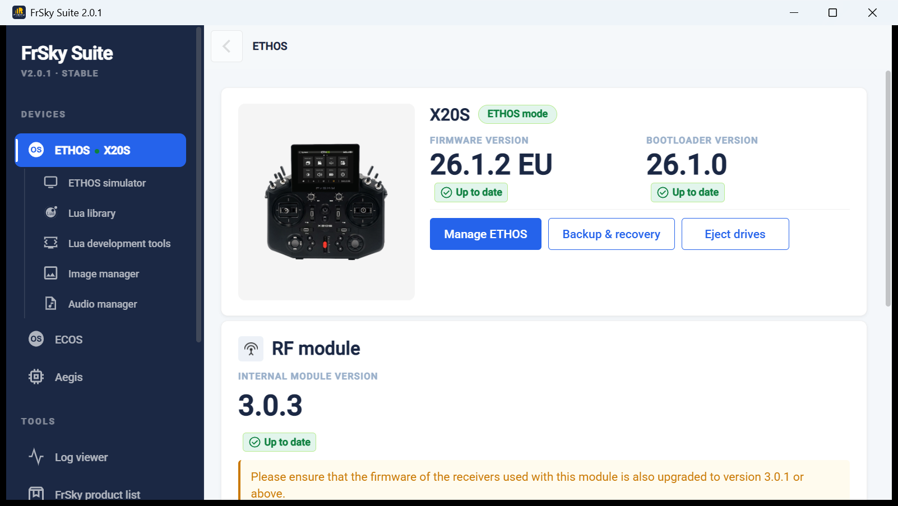
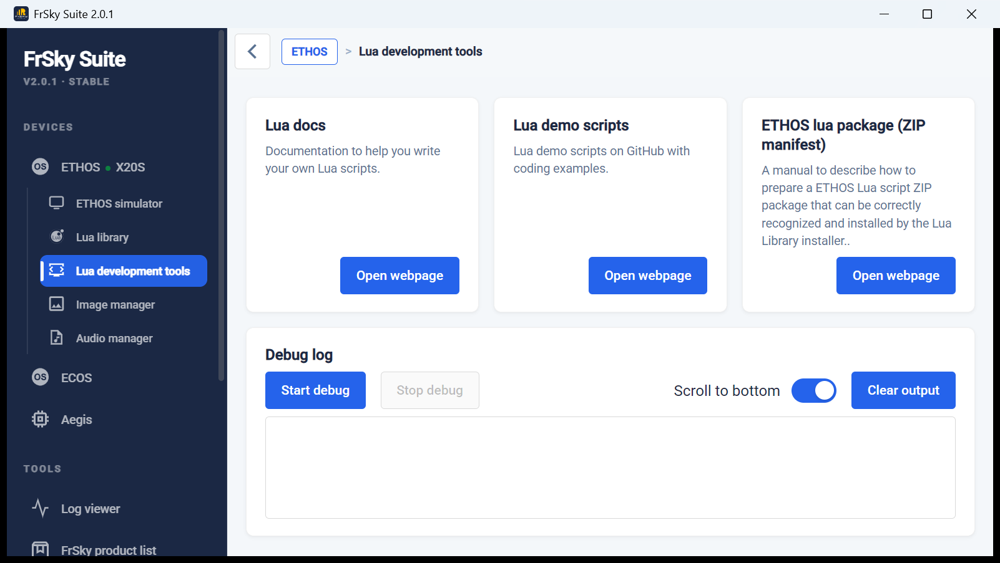
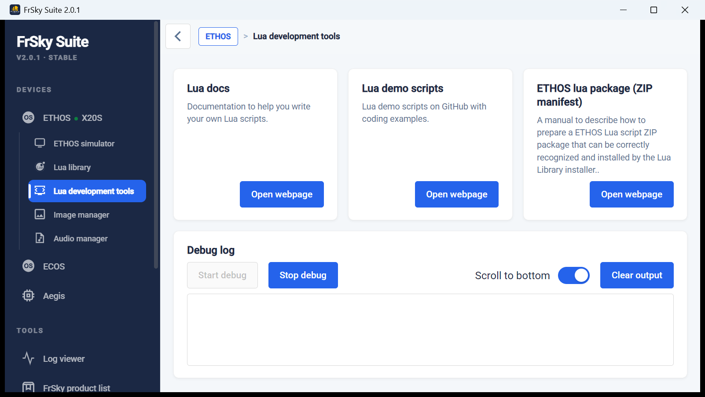
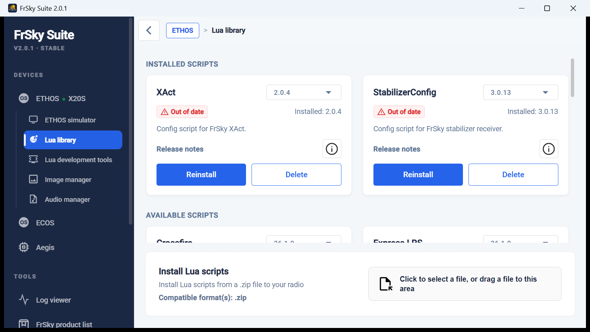

# FrSky Suite

FrSky Suite (formerly *Ethos Suite*) is FrSky's desktop companion app. For Lua developers it has four useful parts: **Lua development tools** (a live debug log from the radio), the **Lua library** (install and update script packages), the **Ethos simulator**, and a **command-line mode** for scripting deployments.

*Screenshots and command output on this page are from FrSky Suite 2.0.1 on Windows, with an X20S running Ethos 26.1.2.*

{ loading=lazy }

## Lua development tools: live debug log

**ETHOS → Lua development tools** links to the Lua docs, FrSky's demo scripts and the ZIP manifest spec, and has a **Debug log** panel.

{ loading=lazy }

**Start debug** switches the radio's USB connection to serial debug mode. Everything your scripts `print()` on the radio then streams into the panel. **Stop debug** switches back.

{ loading=lazy }

!!! warning "Debug mode unmounts the radio's drive"
    The radio's USB port has two interfaces: an always-present **HID control** interface and a second interface that is **either** USB mass storage **or** a serial port. Starting debug swaps storage for serial, so the radio's drive disappears from your computer until you stop debug. To copy files and then watch output, deploy first and start debug afterwards, or use a [deploy script](vscode.md) that does both.

## Lua library: installing packages

**ETHOS → Lua library** lists installed scripts with their version and an *Out of date* badge when a newer version is available, plus FrSky's available scripts. **Install Lua scripts** accepts a `.zip` with an [`ethos_lua_manifest.json`](../getting-started/packaging.md#installable-zip-packages).

{ loading=lazy }

## Ethos simulator

**ETHOS → Ethos simulator**: choose radio, release and protocol, then start it. Its storage is a normal folder on your computer, shown as *Current local simulator directory*. On Windows it defaults to:

```text
%APPDATA%\FrSky Suite\.simulator
```

Copy your script into that radio's `scripts/` folder and restart the simulator. Delete any stale `main.luac` too, since Ethos compiles `main.lua` on load. Nightly Ethos versions are offered only when **GitHub** is selected as the server location in Suite's settings.

!!! tip "Simulate your real radio"
    Back up the radio (**Backup & recovery**), close Suite, then replace the simulated radio folder's contents with the backup. The simulator then boots with your models, screens and scripts.

## Command line

The Suite executable doubles as a command-line tool. Each call takes about a second, prints a short report, and ends with an `exit code:` line.

```text
"C:\Program Files\FrSky Suite\FrSky Suite.exe" --help
```

```text
FrSky Suite command line tool help.

Command:
--version                       Show the version of the installed FrSky Suite.
--sim-path                      Get the simulator persist files path.
--list-radios                   List all the supported FrSky radios.
--radio-components              List all the components and their paths.
--get-path {COMPONENT}          Get the path of the given component. Current supported component: BITMAPS, SCRIPTS, SCREENSHOTS, AUDIO, I18N.
--serial start|stop             Enable / disable the serial debug mode.

Optional:
[--radio {RADIO}]               For simulator. Return the path of the specified radio type. Or return the persist folder if [--radio {RADIO}] is omitted
                                For real radio. If multiple radios are connected to your computer, you can use [--radio {RADIO}] to specify one. Otherwise, you can omit [--radio {RADIO}] or use [--radio auto] for automatic detection.
```

!!! danger "Running it from VS Code (or an AI agent inside VS Code)? Clear `ELECTRON_RUN_AS_NODE`"
    Suite is an Electron app. VS Code sets `ELECTRON_RUN_AS_NODE=1` for processes it starts (integrated terminal, tasks, extensions, AI agents), and that variable turns any Electron app into **plain Node.js**. Then `--help` prints Node's help, `--version` prints `v16.13.0`, and every Suite option fails with `bad option`. Clear it first:

    === "PowerShell"
        ```powershell
        Remove-Item Env:ELECTRON_RUN_AS_NODE -ErrorAction SilentlyContinue
        & "C:\Program Files\FrSky Suite\FrSky Suite.exe" --version
        ```
    === "cmd"
        ```bat
        set ELECTRON_RUN_AS_NODE=
        "C:\Program Files\FrSky Suite\FrSky Suite.exe" --version
        ```
    === "bash / Python subprocess"
        ```bash
        env -u ELECTRON_RUN_AS_NODE "/c/Program Files/FrSky Suite/FrSky Suite.exe" --version
        ```

### Every option, tried on a real radio

| Command | Output (X20S over USB) | Exit |
| --- | --- | --- |
| `--version` | `2.0.1` | 0 |
| `--list-radios` | `FrSky X20S Interface \| \\?\HID#VID_0483&PID_5750&MI_00#...` | 0 |
| `--radio-components` | Table of `BITMAPS`, `SCRIPTS`, `SCREENSHOTS`, `AUDIO` → `E:/bitmaps`, `E:/scripts`, ... | 0 |
| `--get-path SCRIPTS` | `E:/scripts` | 0 |
| `--get-path SCRIPTS --radio auto` | `E:/scripts` | 0 |
| `--get-path I18N` | `Unknown component name...`: listed in the help, but not reported by this radio | -1 |
| `--serial start` | `Start lua debug "FrSky X20S Interface" at path: ...`. The drive unmounts and a serial port (e.g. `COM15`) appears a few seconds later | 0 |
| `--serial stop` | `Stop lua debug "FrSky X20S Serial Port" ...`. The serial port goes and the drive remounts (about 2 s here) | 0 |
| `--sim-path` | `Simulator path not provided.` in every variation tried (with and without `--radio`) | -1 |

Notes:

- The radio shows up as USB **VID `0483`, PID `5750`**. In debug mode its serial port has the same IDs, which is how tools find the right COM port.
- Paths use forward slashes even on Windows (`E:/scripts`).
- A non-zero exit code means failure. Check it in scripts rather than parsing the text.

### Using it from a deploy script

```python
import os, subprocess

SUITE = r"C:\Program Files\FrSky Suite\FrSky Suite.exe"
env = {k: v for k, v in os.environ.items() if k != "ELECTRON_RUN_AS_NODE"}

def suite(*args):
    r = subprocess.run([SUITE, *args], env=env, capture_output=True, text=True, timeout=30)
    lines = [l for l in r.stdout.splitlines() if l.strip() and not l.startswith("exit code")]
    return r.returncode, lines

code, out = suite("--get-path", "SCRIPTS")
if code == 0:
    scripts_dir = out[-1]          # e.g. "E:/scripts"
```

Suite isn't the only way to do this. The same USB HID commands can be sent directly from Python, which works on macOS and Linux too. See [VS Code deployments](vscode.md#talking-to-the-radio-over-usb).
