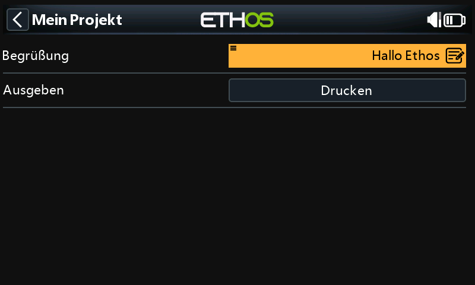
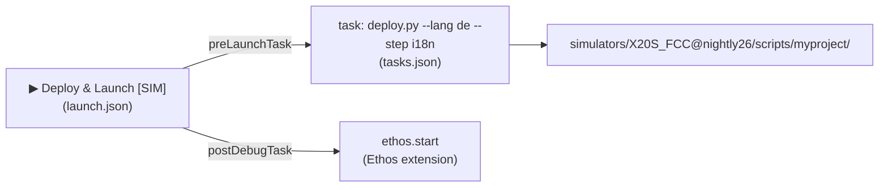

# VS Code project template

**[FrSkyRC/ethos-lua-vscode-template](https://github.com/FrSkyRC/ethos-lua-vscode-template)** is a complete VS Code project for Ethos Lua scripts. Press ▶ to deploy to the simulator or a USB radio, stream the radio's `print()` output, translate your script, and publish installable release zips from a git tag.

The deploy tooling is the same one large open-source Ethos suites use every day, with the project-specific parts removed. To understand how it works underneath (USB HID, drive discovery, safe copying), read [VS Code deployments](vscode.md).

{ loading=lazy width=480 }
<small>The template's starter tool in the Ethos 26.1 simulator, deployed with the German translation.</small>

## Quick start

1. On GitHub, click **Use this template** → *Create a new repository*, then clone it.
2. [Install Python](#installing-python) and VS Code.
3. Rename the starter project:

    ```bash
    python .vscode/scripts/new_project.py mywidget --title "My Widget" --key com.yourname.mywidget
    ```

4. Open the folder in VS Code and accept the recommended extensions (**Ethos**, **Python**, **Python Debugger**, **Lua**).
5. Click the Ethos status-bar item → pick radio, protocol and release.
6. **Run and Debug** (Ctrl+Shift+D) → **Deploy & Launch [SIM]** → ▶.

## Installing Python

The play buttons run Python scripts, so you need Python 3.10 or newer once per computer.

=== "Windows"
    Install from [python.org/downloads](https://www.python.org/downloads/). On the first installer screen tick **Add python.exe to PATH**. Open a new terminal and check:
    ```text
    python --version
    ```
=== "macOS"
    ```bash
    brew install python      # https://brew.sh, or use the python.org installer
    python3 --version
    ```
=== "Linux"
    ```bash
    sudo apt install python3 python3-pip
    python3 --version
    ```

Then in VS Code: **Ctrl+Shift+P → Python: Select Interpreter** and choose it. The play buttons use the interpreter you select here.

You don't need to install packages by hand. The first deploy installs `tqdm`, `pyserial`, `hidapi` (and `pywin32` on Windows) into that interpreter. To do it yourself: `python -m pip install tqdm pyserial hidapi pywin32`.

## What you change per project

!!! important "The one table to read"
    Everything you edit is listed here. **`.vscode/scripts/`, `bin/package/` and `.github/` are shared tooling: don't edit them.** That way you can update them from the template later, and every project built on it behaves the same.

| File | Change | Set by `new_project.py`? |
| --- | --- | --- |
| `src/<project>/` | **Your Lua code**: everything that runs on the radio (deployed to `SCRIPTS:/<project>/`) | Folder renamed |
| `.vscode/deploy.json` → `tgt_name` | Project folder name; must match `src/<project>/` | ✔ |
| `src/<project>/main.lua` → `BASE` | `SCRIPTS:/<project>/`, the absolute path for files used from callbacks ([why](../getting-started/lua-environment.md#relative-paths-only-work-while-your-script-loads)) | ✔ |
| `src/<project>/ethos_lua_manifest.json` | `name`, `key`, `version`, `introduction`. **`key` never changes after the first release** | ✔ (name, key, folder) |
| `src/<project>/widget.lua` → `key` | Widget key, max 7 chars. **Never changes after release** | ✔ |
| `i18n/<lang>.json` | Your text, one file per language | `project.name` in `en.json` |
| `.vscode/launch.json` → `inputs.deployLanguage.options` | The languages offered by *Set Deployment Language* | |
| `.vscode/settings.json` → `ethos.board` / `protocol` / `release` | The simulator, normally set through the Ethos extension | |
| `.vscode/deploy.json` → `serial_*`, `ethossuite_bin` | Only for unusual radios. FrSky Suite is optional | |
| `Releases.md` | Release notes, one `# X.Y.Z` section per version | |
| `README.md`, `AGENTS.md` | Describe your project | `src/` paths |

## The play buttons

Each entry in the **Run and Debug** dropdown is a `launch.json` configuration. Its `preLaunchTask` runs a task from `tasks.json`, which calls the deploy script with the Python interpreter you selected:



| ▶ Configuration | Runs | Result |
| --- | --- | --- |
| **Deploy & Launch [SIM]** | `deploy.py --lang <lang> --step i18n` → `ethos.start` | Mirrors `src/<project>/` into the selected simulator, resolves translations, starts the simulator |
| **Deploy Radio** | `deploy.py --radio ...` | Finds the radio over USB HID, switches to storage if needed, waits for its drive, **full** copy, then switches the radio to serial mode so it releases USB storage and runs the new code |
| **Deploy Radio [Fast]** | `--fileext fast --radio` | Copies only changed files (MD5) and removes deleted ones. The everyday choice |
| **Deploy Radio + Serial Debug** (and **[Fast]**) | `... --radio-debug` | Deploys, then streams the radio's `print()` output until stopped |
| **Radio: Serial Debug** | `--radio --connect-only` | No copy; stream `print()` output |
| **Simulator: Set Simulator / Open Controls / Open Telemetry** | Ethos extension commands | |
| **Set Deployment Language** | `set_language.py <lang>` | Sets `ethos.deploy.language` for every deploy |
| **Package: Build Zip [current language]** / **[all languages]** | `bin/package/build_package.py` | Installable zips in `dist/` |
| **Debug Radio Connection** | `debug_connection.py` | Diagnoses USB/HID/drive detection |
| **Clear locks** | `deploy.py --clear-lock` | Removes a stale lock after a crashed deploy |

**Deploy steps.** `--step <name>` runs `.vscode/scripts/deploy_step_<name>.py --out-dir <deployed folder> --lang <lang> --git-src <repo>` after copying, on a local staging copy for radio deploys. The template ships `i18n` and a commented `example` step that writes `build_info.lua`. Add your own for generated files, sound packs, or stripping debug files.

## Translations

User-facing text goes in Lua strings as tags, and the words go in `i18n/<lang>.json`:

=== "src/myproject/tool.lua"
    ```lua
    local line = form.addLine("@i18n(tool.greeting)@")
    ```
=== "i18n/en.json"
    ```json
    { "tool": { "greeting": "Greeting" } }
    ```
=== "i18n/de.json"
    ```json
    { "tool": { "greeting": "Begrüßung" } }
    ```

Deploys and packages replace each tag with the selected language's text, falling back to English. On the radio the code is plain text with no lookup cost and no translation tables in RAM, which is why large projects use this approach rather than loading translations at runtime. Tags can transform text (`@i18n(tool.print):upper()@`, `:truncate(8)`); `python .vscode/scripts/resolve_i18n_tags.py --list-transforms` lists them. Missing keys are reported after each deploy.

For runtime language switching without a build step, see [Translations](../guides/i18n.md).

## Releases and git tags

Users install your script with **FrSky Suite → Lua library → Install from local .zip** or the web simulator's **Upload a Lua plugin**. The template builds those zips (one per language, each with a generated [`ethos_lua_manifest.json`](../getting-started/packaging.md#installable-zip-packages)) and publishes them from a git tag.

**To release version 1.2.0:**

1. Set `"version": "1.2.0"` in `src/<project>/ethos_lua_manifest.json`.
2. Add a section at the top of `Releases.md`:

    ```markdown
    # 1.2.0

    - New: battery percentage
    - Fixed: font on small screens

    ***
    ```

3. Commit, then tag and push the tag:

    ```bash
    git commit -am "Release 1.2.0"
    git push
    git tag release/1.2.0
    git push origin release/1.2.0
    ```

The **Release** workflow builds a zip per `i18n/*.json` language, validates each manifest, and publishes a GitHub release with the `Releases.md` notes. The same notes appear in FrSky Suite's Lua library.

| Tag | Publishes |
| --- | --- |
| `release/1.2.0` | Release |
| `release/1.2.0-rc1` | Release Candidate (pre-release) |
| `snapshot/1.2.0-dev3` | Snapshot (pre-release) |

The manifest needs a numeric `X.Y.Z`, so `1.2.0-rc1` installs as `1.2.0`. The full label is kept in `build_info.lua` inside the zip (`return { version = "1.2.0-rc1", lang = "de", commit = "...", built = "..." }`), which your script can read at load time.

Wrong tag? `git tag -d release/1.2.0 && git push --delete origin release/1.2.0`, and delete the GitHub release.

The **CI** workflow runs on every push and pull request. It builds every language, syntax-checks every Lua file with `luac5.4 -p` after translation, validates the manifests, and attaches test zips to the run.

## Tested

Checked on Windows with the X20S simulator (Ethos 26.1):

- rename → simulator deploy in German → boot with no Lua errors → tool opened with translated labels (screenshot above) → `print()` output (`[hellow] Hallo Ethos`) in the log;
- `--all-langs` packaging → both zips pass the manifest validator → `luac5.4 -p` on every file → CI green on GitHub.

The radio deploy path is the suites' code, unchanged apart from names. The USB protocol it uses (HID storage/serial switching, `*.cpuid` drive discovery, incremental copy) was verified on an X20S in [VS Code deployments](vscode.md#7-the-deploy-tool). The template's own `--radio` run so far has only shown the expected "radio not on USB" handling, with a clear error after 60 s.
