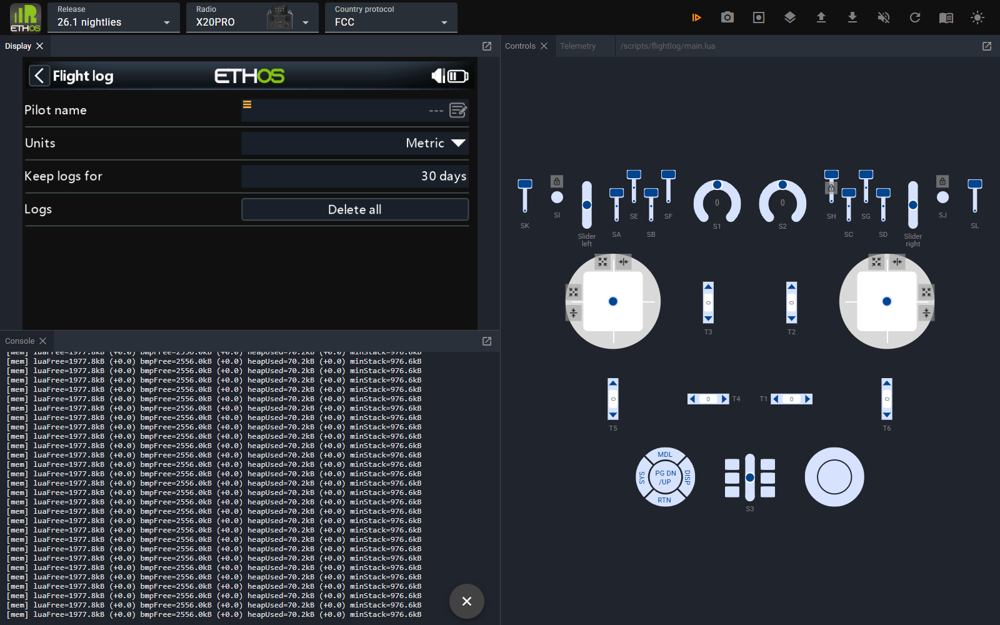
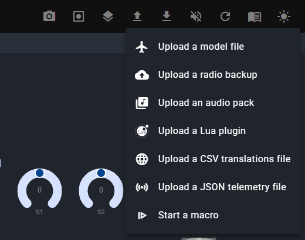
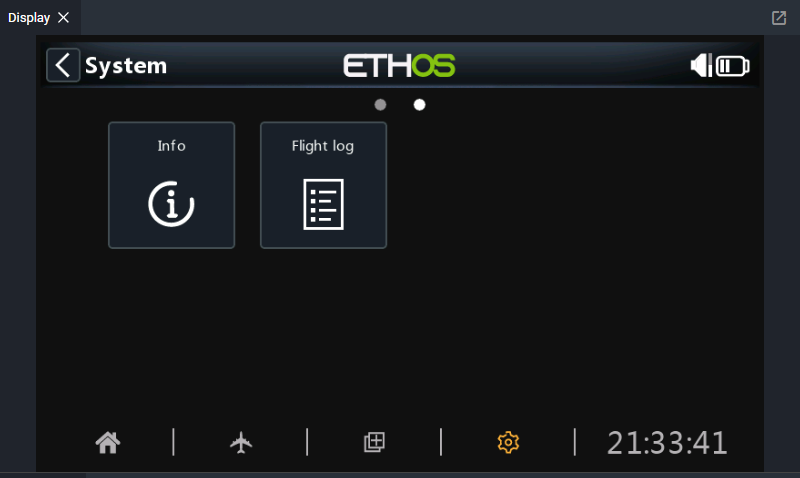
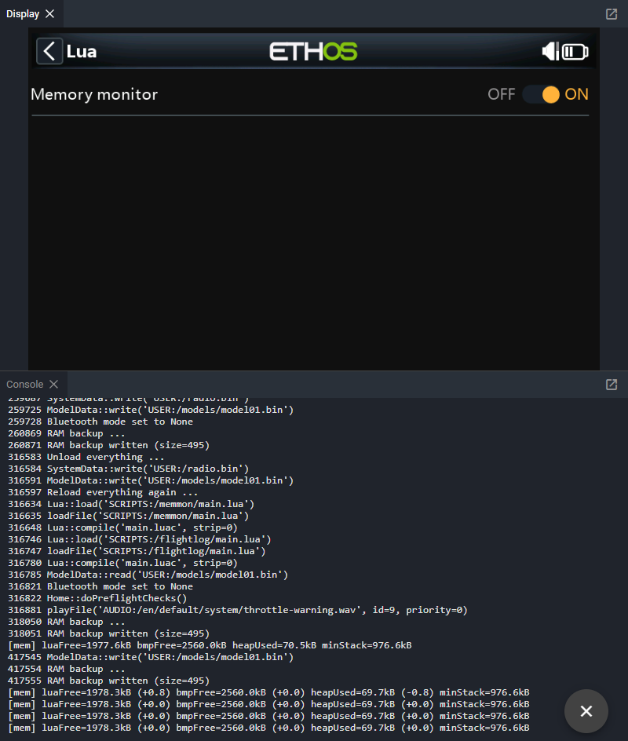
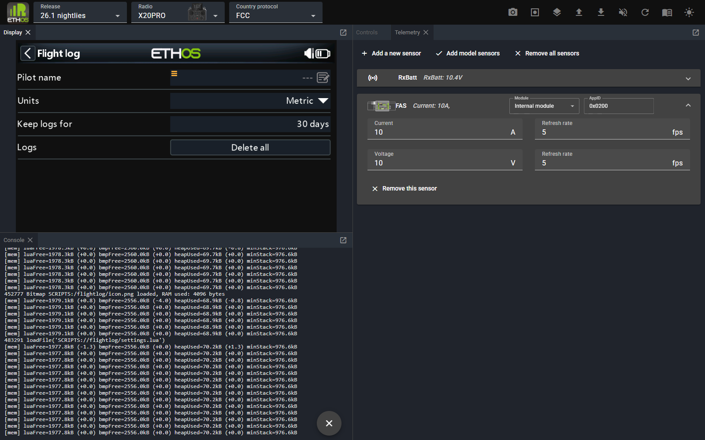
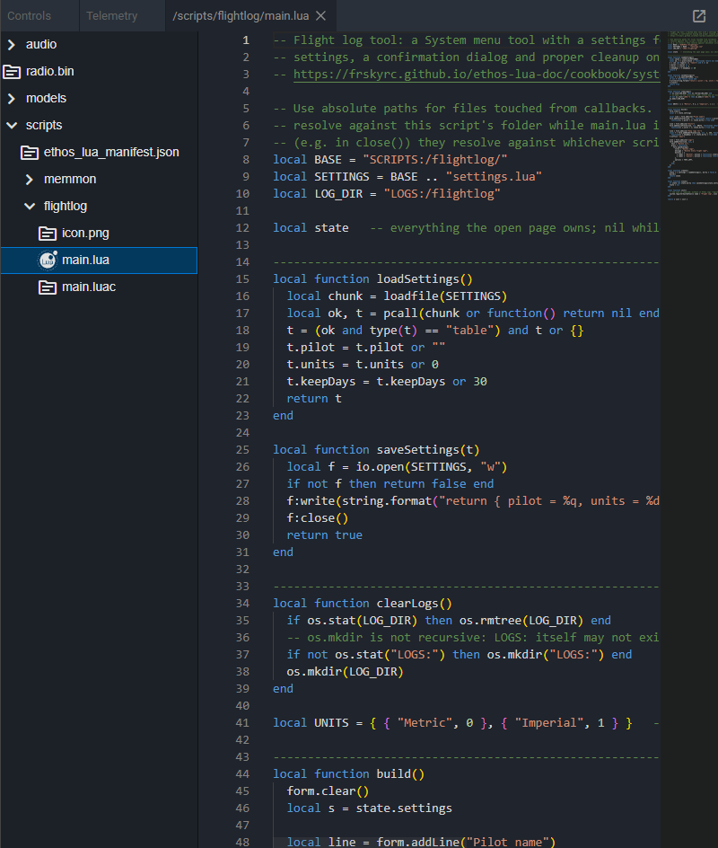
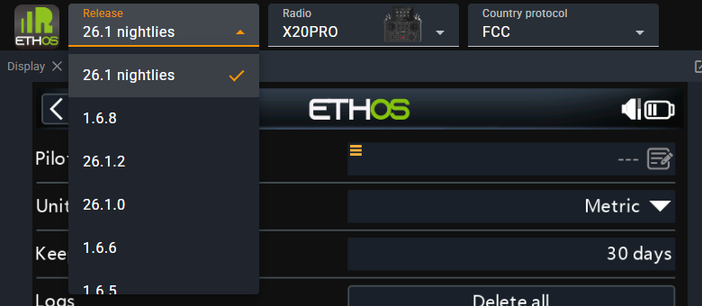

# Web simulator

FrSky's browser simulator runs the real Ethos firmware compiled to WebAssembly, so there's nothing to install. Chrome is recommended.

**[ethos-simulator.frsky-rc.com](https://ethos-simulator.frsky-rc.com/)**

You pick the Ethos release, the radio and the RF protocol, and get the radio's screen, its controls, and optional panels such as the **Console** and **Telemetry**.

*Screenshots on this page are from the web simulator running Ethos 26.1.3 ("26.1 nightlies") on an X20PRO, with two cookbook scripts installed: the [memory monitor](../cookbook/memory-monitor.md) task and the [system tool](../cookbook/system-tool.md).*

{ loading=lazy }

A fresh simulator starts like a new radio: a language prompt, a "default system settings restored" notice and the model wizard. Click through them once; the simulated SD card is kept in the browser, so later sessions boot straight to the home screen.

## Running your script

1. Zip your script. Include an [`ethos_lua_manifest.json`](../getting-started/packaging.md#installable-zip-packages) at the root; it's the package format Ethos installers understand.
2. **Upload → Upload a Lua plugin**.
3. If your script doesn't show up straight away, use the toolbar's **Restart**. Scripts are loaded at boot. Your widget, tool or task is then available as on a radio.

{ loading=lazy }

!!! warning "Put your files in a folder inside the zip"
    The web simulator unzips the package into `SCRIPTS:` exactly as it is laid out; it does not apply the manifest's `folder`. A zip with `main.lua` at its root ends up as `SCRIPTS:/main.lua`. Put the files in a folder named after `folder` (`myscript/main.lua`, with `"files": ["myscript/**"]`). FrSky Suite strips that leading folder name on install, so the same zip works in both. *Verified in the web simulator (Ethos 26.1.3) with the **Code explorer** panel.*

Installed tools appear in the **System** menu, widgets in the widget picker. A task also has to be switched on under **Model → Lua**.

{ loading=lazy }

To start from your real setup instead of a blank radio, make a backup in FrSky Suite and use **Upload → Upload a radio backup**. You get your models, screens and scripts.

## Panels worth opening

Open panels from the toolbar's **Panels** button. Drag a panel's tab to dock it beside or below another; the layout is remembered by the browser.

| Panel | Why |
| --- | --- |
| **Debug console** | Boot log, `print()` output and **Lua errors**. Dock it below the display so long lines are readable. Open it before anything else when developing |
| **Telemetry** | Add simulated sensors (**Add a new sensor**) and set their values, so telemetry widgets have data. Save the set with **Download → Save telemetry settings** and restore it later with **Upload → Upload a JSON telemetry file** |
| **Code explorer** | Browse the simulated SD card (`scripts/`, `models/`, `audio/`) and view files, including what an upload actually installed |
| **Controls** | Open by default. Sticks, switches, pots and trims. Gimbals can be locked to one axis or set to auto-centre, and momentary switches can be latched, which helps when testing |

The console below shows the memory monitor task's `print()` output every five seconds, after it was switched on under **Model → Lua**:

{ loading=lazy }

Telemetry sensors, here a receiver voltage and an FAS current sensor:

{ loading=lazy }

Code explorer, showing an installed script and its compiled `main.luac`:

{ loading=lazy }

## Upload and Download menus

| Upload | Download |
| --- | --- |
| Model file (`.bin`) | Current model (`.bin`), or edit it as JSON |
| Radio backup | Radio backup (`.zip`) |
| Audio pack (`.zip`) | All screenshots |
| **Lua plugin (`.zip`)** | Telemetry settings (`.json`) |
| CSV translations | |
| JSON telemetry file | |
| Start a macro (`.zip`) | |

The toolbar also has screenshot, recording, audio on/off, restart, documentation and light/dark mode.

## Testing across radios and versions

Switching the release lets you check a script against the firmware your users run. Switching the radio checks layout on different screen sizes.

{ loading=lazy }

Two habits:

- Test on the **smallest** screen you support (X18 family, 480×320) as well as the largest.
- Before relying on a new API, check its **since** version on its [API page](../api/index.md), then load an older release in the simulator to confirm your fallback works.

!!! note "Command-line and AI use"
    The same WebAssembly builds can run headless from a terminal with [`ethos-tools`](ai-agents.md), which also lets an AI agent drive the radio.
